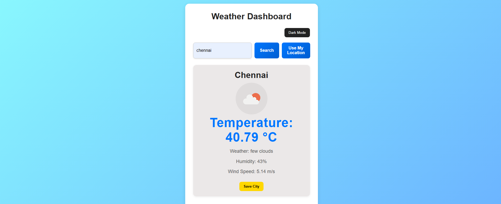
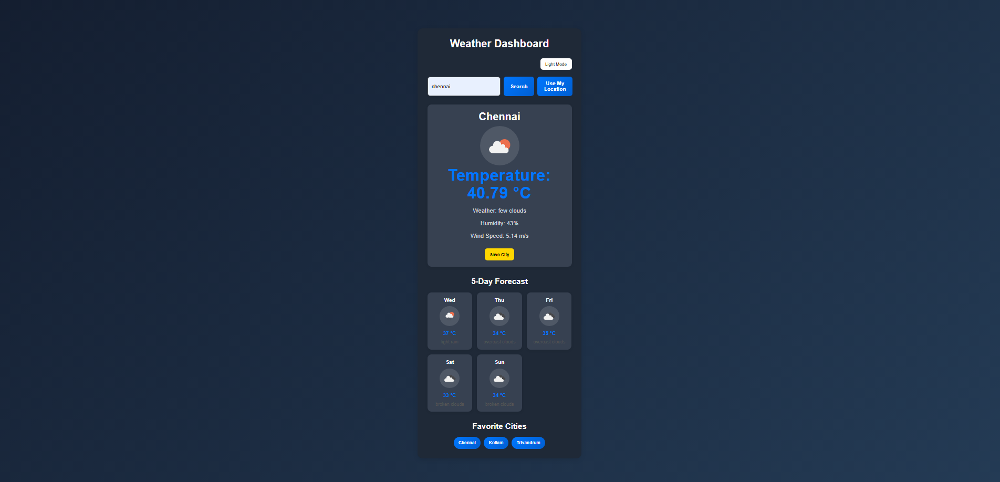

# Weather Dashboard Application

## Project Overview

The Weather Dashboard Application is a responsive web application developed using HTML, CSS, and JavaScript.  
The application fetches real-time weather data from the OpenWeatherMap API and displays current weather information along with a 5-day forecast.

The project also includes advanced frontend features such as:
- Dark Mode
- Favorite Cities
- Geolocation
- Local Storage Persistence
- Responsive Design

This project demonstrates the use of asynchronous JavaScript, REST APIs, modular JavaScript, Local Storage, and responsive web design.

---

## Live Demo

 https://abi178.github.io/WeatherDashboard/
---

# Features

- Search weather by city name
- Display current weather information
- Show 5-day weather forecast
- Dynamic weather icons
- Save last searched city using Local Storage
- Save favorite cities
- Dark mode toggle
- Current location weather using Geolocation API
- Loading state and error handling
- Fully responsive design for mobile and desktop

---

# Technologies Used

- HTML5
- CSS3
- JavaScript (ES6 Modules)
- OpenWeatherMap API
- Local Storage API
- Geolocation API

---

# Project Structure

```
project-folder/
│
├── index.html
│
├── css/
│   └── styles.css
│
├── js/
│   ├── app.js
│   ├── api.js
│   └── storage.js
│
├── screenshots/
│
└── README.md
```

---

# Setup Instructions

1. Clone the repository

```bash
git clone https://github.com/abi178/WeatherDashboard.git

```

2. Open the project folder
3. Get your API key from OpenWeatherMap
4. Add your API key inside api.js
5. Open index.html in your browser

---

# API Used

## OpenWeatherMap API

Current Weather Endpoint:
- ```https://api.openweathermap.org/data/2.5/weather```

Forecast Endpoint:
- ```https://api.openweathermap.org/data/2.5/forecast```

---

# JavaScript Concepts Used

- Async/Await
- Fetch API
- Promises
- REST APIs
- JSON handling
- DOM manipulation
- Event listeners
- Local Storage
- ES6 Modules
- Error handling

---

# Responsive Design

The application is fully responsive and works properly on:

- Desktop
- Tablet
- Mobile devices

Media queries were used to improve responsiveness and layout on smaller screens.

---

# Additional Features

1. Dark Mode

Users can switch between light mode and dark mode using the theme toggle button.

2. Favorite Cities

Users can save favorite cities and quickly access them later.

3. Geolocation

Users can fetch weather information based on their current location using the browser Geolocation API.

---

# Error Handling

The application handles:

- Invalid city names
- Empty search input
- API/network errors
- Geolocation permission denial

---

# Screenshots

## Weather result



## 5-day forecast


## Dark mode



